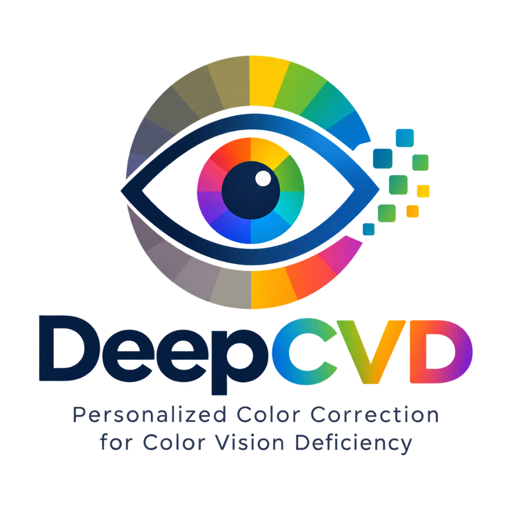

#  DeepCVD — Personalized Color Correction for Color Vision Deficiency

Interactive research dashboard, clinical diagnostic platform, and neural recolouring studio for **Color Vision Deficiency (CVD)** restoration. Powered by a lightweight **Restormer Transformer** with Multi-Dconv Head Transposed Attention (MDTA), Gated Dconv Feed-Forward Networks (GDFN), and Residual Dense Blocks (RDB).

[](https://vercel.com/new/clone?repository-url=https%3A%2F%2Fgithub.com%2Fridwanoorrahmanrafi%2FCVD-Result-UI)

---

## 🚀 Features

- **Official Project Logo**: DeepCVD brand identity representing spectral color vision restoration and digital accessibility.
- **Clinical Ishihara Diagnostic Suite (Physically Accurate HPE LMS Engine)**:
  - Accessible directly in the dashboard and via dedicated standalone page at `/ishihara` and `/ishihara.html`.
  - Built on physical Hunt-Pointer-Estevez (HPE) RGB-to-LMS cone transformation and inverse matrices.
  - Multi-tier circle packing disc generator with collision avoidance simulating classic Ishihara booklets.
  - Demonstration, screening, and differential classification plates with dual-axis L-cone ($L_d$) and M-cone ($M_d$) shifts.
  - Instant one-click diagnostic transfer to DeepCVD Studio, auto-configuring Restormer (+RDB) for the detected condition.
- **results.json Driven Color Correction**:
  - The in-browser Canvas2D shader engine is dynamically driven by the empirical benchmarks in `results.json` (and `result.json`), modulating chromatic boost ($W_{\text{chroma}}$), edge retention ($W_{\text{edge}}$), and luminance shift ($W_{\text{lum}}$) based on $\Delta E_{00}$ error reduction, PSNR fidelity gains, and MS-SSIM/LPIPS composite metrics.
  - Architectural ablation multipliers ($M_{\text{contrast}}$, $M_{\text{edge}}$) automatically scale the weights for each Restormer variant (+RDB, Base, +CBAM, +CBAM+RDB).
  - Live Model Calibration Banners on each model card display real-time weights and $\Delta E_{00}$ reduction.
  - Interactive **Mathematical Formula Inspector** exposes all calibration equations and a live parameter table.
  - Custom `results.json` upload input allowing arbitrary experimental results to drive recolouring without code changes.
- **Dataset & PyTorch Offline Inference Comparison**:
  - Presets from real research dataset (`data/original/`) including `Dog`, `Tiger`, `Flower 0002`, and `Bunny`.
  - One-click toggle switch to compare real-time browser recolouring against precomputed offline PyTorch model outputs (`data/corrected/`).
- **Interactive Metric Exploration**: Comprehensive benchmark tables and visualizations comparing **Proposed Restormer**, **U-Net**, **Plain CNN**, and **No Recolouring Baseline**.
- **Comprehensive Quality Metrics**:
  - **PSNR** & **SSIM** / **MS-SSIM** (Structural Similarity)
  - **MAE** (Mean Absolute Error)
  - **LPIPS** (Perceptual similarity)
  - **$\Delta E_{00}$** (CIE $\Delta E_{00}$ color difference — mean and median)
- **Ablation & Complexity Analysis**: Parameter count, GMACs, latency, and throughput (FPS) across model configurations (Base Restormer, +CBAM, +RDB, +CBAM+RDB).
- **Statistical Significance**: Paired test results with effect sizes and Holm-Bonferroni corrected p-values.
- **Visual Inspection & Studio**: Real-time side-by-side recolouring and perceptual simulation using sample, dataset, and custom user-uploaded imagery.

---

## 🛠️ Project Structure

```text
├── logo.png            # Official DeepCVD project logo & favicon
├── app.py              # Flask backend serving API, dashboard, and dataset images
├── index.html          # Interactive frontend dashboard, clinical studio & formula inspector
├── ishihara.html       # Standalone LMS-calibrated clinical Ishihara diagnostic suite
├── results.json        # Evaluation metrics, ablation, and statistical test results
├── report.txt          # Master project defense report, architectural comparison & viva guide
├── audit.txt           # Comprehensive project audit, report & 4-member contribution matrix
├── requirements.txt    # Python dependencies (flask, flask-cors)
├── run.bat             # One-click startup script for Windows
├── data/               # Evaluation dataset repository
│   ├── original/       # 858 high-resolution original test images
│   └── corrected/      # PyTorch model offline inference outputs (protanopia, deutan, tritan)
├── samples/            # Visual evaluation sample images
│   ├── fruits.jpg
│   ├── ishihara.jpg
│   └── logo.png
└── README.md
```

---

## 💻 Getting Started

### 1. Prerequisites
- Python 3.10+ (or Python 3.11+)

### 2. Installation

Clone the repository:
```bash
git clone https://github.com/ridwanoorrahmanrafi/CVD-Result-UI.git
cd CVD-Result-UI
```

Install dependencies:
```bash
pip install -r requirements.txt
```

### 3. Run the Dashboard

#### On Windows:
Double-click `run.bat` or run:
```powershell
python app.py
```

#### On Linux / macOS:
```bash
python3 app.py
```

### 4. Access the UI
Open your browser and navigate to:
```
http://127.0.0.1:5000/
```

---

## 📡 API Endpoints

| Endpoint | Method | Description |
| :--- | :--- | :--- |
| `/` | `GET` | Serves the interactive dashboard interface |
| `/api/results` | `GET` | Returns full evaluation JSON dataset |
| `/api/health` | `GET` | Health check endpoint (`{"status": "ok"}`) |
| `/samples/<filename>` | `GET` | Serves sample comparison images |

---

## 📝 Customizing Results

To display results from your own model training or notebook evaluations:
1. Export your evaluation results matching the structure of `results.json`.
2. Overwrite `results.json` in the root directory.
3. Refresh the dashboard!
